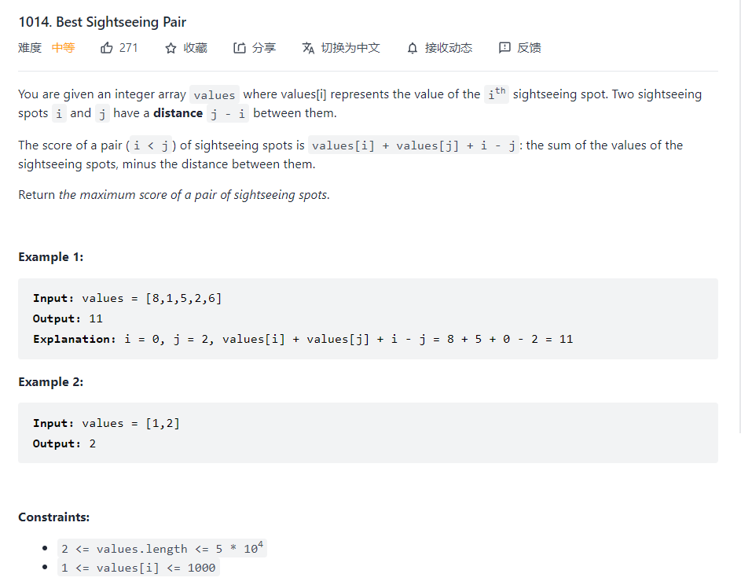

### Best sightseeing pair



这道题目其实看过去也是能很快想到解法，首先就是暴力解法，暴力解法的就是遍历两遍来得到答案，但是这个一般不会是最终答案，因为复杂度是$O(n^2)$,认真一想，其实这道题是一道动态规划题，因为其实values[j]-j是固定的，我们只需要记录前面的最大的values[i]+i就可以，严格来说其实遍历也可以解决，所以动态规划很容易能够进行编程

```python
n = len(values)
premax = values[0]
max_value = -1
for i in range(1,n):
premax = max(values[i-1]+i-1,premax)
max_value = max(max_value,premax+values[i]-i)
return max_value
```

其中premax是整个动态规划的关键，可以理解成dp，这里就可以将时间复杂度降到$O(n)$,并且空间复杂度是$O(1)$,也就能顺利完成题目了。

本质上是固定values[i]-i,转变为求value[i]+i的动态规划问题，反映在数列中就是是否选当前的状态，是否进行跳转