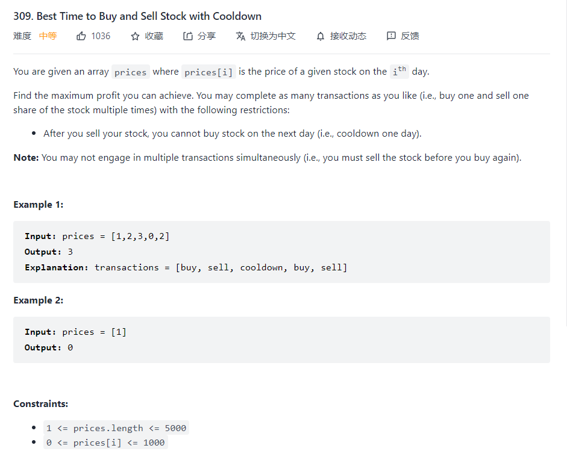
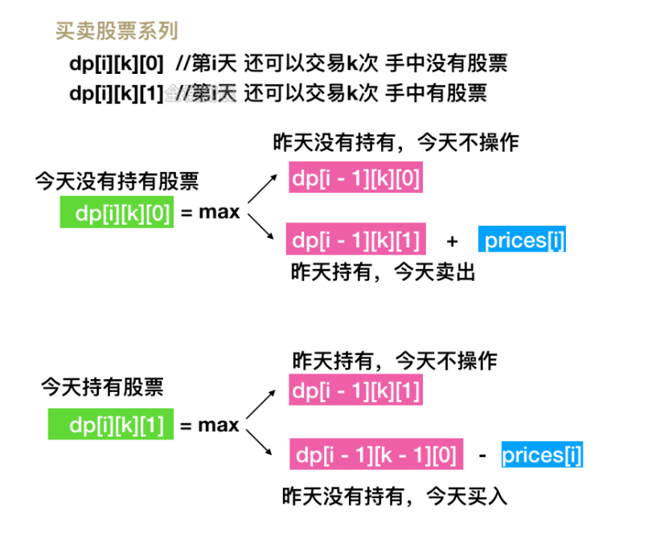

### Best Time to Buy and Sell Stock with Cooldown



在这里，唯一的区别在于这里多了一个cooldown,其实可以总结出一套适用于整个股票问题的一个通试



那么其实一共可以分四种不同的转移方式，如果只允许一次交易的话K可以省去，那么就会降成
$$
dp[i][0] = max(dp[i-1][0],dp[i-1][1]+prices[i]) \\
dp[i][1] = max(dp[i-1][1],dp[i-2][0]-prices[i])
$$
由于有冷冻期，那么需要在如果第i天持有股票那么他有两种可能，一种就是在前一天没有操作，一种就是如果前两天买了，进入冷冻期之后，不能够卖出，导致留到了现在，为什么不能是$dp[i-1][0]-prices[i]$,这样就没有考虑冷冻期了，因为在$dp[i-1][0]$有可能是两种状态转移过来的，所以要从i-2进行考虑，而不是单纯指$dp[i-1]$

```python
class Solution:
    def maxProfit(self, prices: List[int]) -> int:
        n = len(prices)
        dp = [[0]*2 for i in range(n+1)]
        dp[1][0] = 0 #sell
        dp[1][1] = -prices[0] #buy
        # dp[0][2] = 0 #cooldown
        for i in range(2,n+1):
            dp[i][0] = max(dp[i-1][1]+prices[i-1],dp[i-1][0])
            dp[i][1] = max(dp[i-1][1],dp[i-2][0]-prices[i-1])
        return max(dp[-1][0],dp[-1][1])
```

最终在试错之后获得答案

但其实有更为具有语义的答案

我们用 $f[i]$ 表示第 i 天结束之后的「累计最大收益」。根据题目描述，由于我们最多只能同时买入（持有）一支股票，并且卖出股票后有冷冻期的限制，因此我们会有三种不同的状态：

- 我们目前持有一支股票，对应的「累计最大收益」记为 $f[i][0]$；


- 我们目前不持有任何股票，并且处于冷冻期中，对应的「累计最大收益」记为$ f[i][1]$；


- 我们目前不持有任何股票，并且不处于冷冻期中，对应的「累计最大收益」记为 $[i][2]$。


如何进行状态转移呢？在第 i 天时，我们可以在不违反规则的前提下进行「买入」或者「卖出」操作，此时第 ii 天的状态会从第 i-1天的状态转移而来；我们也可以不进行任何操作，此时第 ii 天的状态就等同于第 i-1 天的状态。那么我们分别对这三种状态进行分析：

对于 $f[i][0]$，我们目前持有的这一支股票可以是在第i-1 天就已经持有的，对应的状态为 $f[i-1][0]$；或者是第 ii天买入的，那么第 i-1 天就不能持有股票并且不处于冷冻期中，对应的状态为 $f[i-1][2]$加上买入股票的负收益 ${\it prices}[i]$。因此状态转移方程为：

$$
\begin{equation}
f[i][0]=\max (f[i-1][0], f[i-1][2]-\operatorname{prices}[i])
\end{equation}
$$
对于 $f[i][1]$，我们在第i天结束之后处于冷冻期的原因是在当天卖出了股票，那么说明在第i-1天时我们必须持有一支股票，对应的状态为 $f[i-1][0]$ 加上卖出股票的正收益 ${\it prices}[i]$。因此状态转移方程为：

$$
\begin{equation}
f[i][1]=f[i-1][0]+\text { prices }[i]
\end{equation}
$$
对于 $f[i][2]$，我们在第 i天结束之后不持有任何股票并且不处于冷冻期，说明当天没有进行任何操作，即第 i-1 天时不持有任何股票：如果处于冷冻期，对应的状态为 $f[i-1][1]$；如果不处于冷冻期，对应的状态为 $f[i−1][2]$。因此状态转移方程为：

$$
\begin{equation}
f[i][2]=\max (f[i-1][1], f[i-1][2])
\end{equation}
$$
这样我们就得到了所有的状态转移方程。如果一共有n天，那么最终的答案即为：
$$
\begin{equation}
\max (f[n-1][1], f[n-1][2])
\end{equation}
$$

```python
class Solution:
    def maxProfit(self, prices: List[int]) -> int:
        if not prices:
            return 0
        
        n = len(prices)
        # f[i][0]: 手上持有股票的最大收益
        # f[i][1]: 手上不持有股票，并且处于冷冻期中的累计最大收益
        # f[i][2]: 手上不持有股票，并且不在冷冻期中的累计最大收益
        f = [[-prices[0], 0, 0]] + [[0] * 3 for _ in range(n - 1)]
        for i in range(1, n):
            f[i][0] = max(f[i - 1][0], f[i - 1][2] - prices[i])
            f[i][1] = f[i - 1][0] + prices[i]
            f[i][2] = max(f[i - 1][1], f[i - 1][2])
        
        return max(f[n - 1][1], f[n - 1][2])

```

