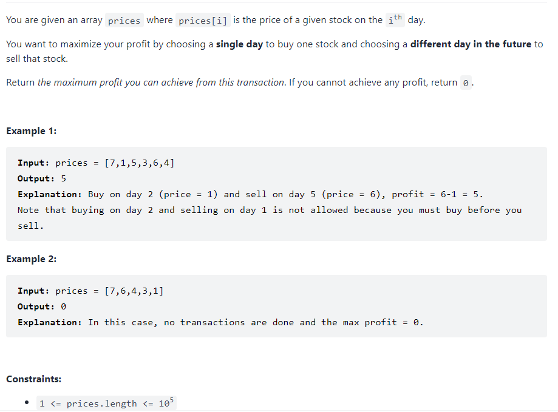

### Best Time buy and sell stock



问题不是特别困难，还是利用动态规划的思想，利用dp数组记录在当日收益的最大值，然后另外需要用一个数来记录到现在为止应该购买股票的最低价格，来保证时序性，类似于之前的最优景点pair的选择。
$$
premin = min(premin,num[i])\\
profit = max(profit,num[i]-premin)
$$
这样子保证了如果没有找到最大收益可以为0，因为长度为$10^5$,所以复杂度应该$O(n)$,才能够足以通过复杂度测试

```python
def maxProfit(self, prices: List[int]) -> int:
    n = len(prices)
    premin = prices[0]
    profit = 0
    for i in range(1,n):
        premin = min(prices[i],premin)
        profit = max(profit,prices[i]-premin)
     return profit
```

同时可以看到是一个滚动的机制，所以可以用一个临时的变量来记录最大值，这样子就可以保证在没有最大profit的时候为0，并且保证空间复杂度降到$O(1)$

