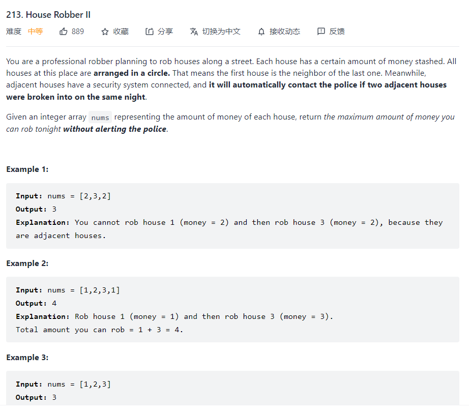

### 打家劫舍2



It is similar to the House robber I and this time the constrain is much tighter where it is in the circle, which means that either head or tail of house can be stashed only once.

Here, we can divide our problem into two different sub-problems (not for dynamic programming) The first one is that we do not consider the head of house and use the same procedure to conduct the result and the other is that we do not consider the tail of house.

So, based on the previous solution of House robber I, we can use dynamic programming to solve the problem

```python
def dynamicprogramming(self,nums):
    n = len(nums)
    dp = [0]*(n+1)
    dp[1] = nums[0]
    for i in range(2,len(nums)+1):
        dp[i] = max(dp[i-1],dp[i-2]+nums[i-1])
        return dp[n]
def rob(self, nums: List[int]) -> int:
    n = len(nums)
    if n <=2 :
       return max(nums)
    result_1 = self.dynamicprogramming(nums[:n-1])
    result_2 = self.dynamicprogramming(nums[1:])
    return max(result_1,result_2)
```

The dynamicprogramming is the auxiliary function for the whole process.

### Conclusion

When encountering the problem like circle, I think the first stuff to be considered is the conditional sub-problems.

### Reference

[打家劫舍Ⅱ 层层递进 一边就懂 不懂就来打我~ - 打家劫舍 II - 力扣（LeetCode） (leetcode-cn.com)](https://leetcode-cn.com/problems/house-robber-ii/solution/da-jia-jie-she-ii-ceng-ceng-di-jin-yi-bi-3gqj/)

