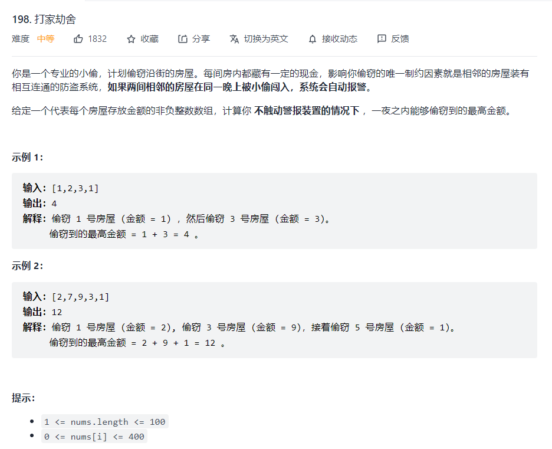
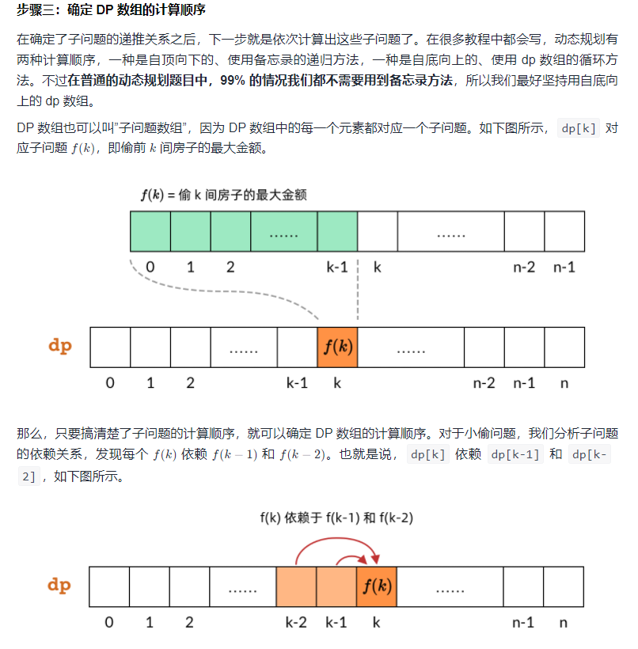

### 打家劫舍



不能同时选取相邻的两个数
$$
dp[n] = \max(dp[n-i]+money[n])  \\
\text{where i equals 2} \cdots n
$$
这是自己的思路，这样就可以写出动态规划的解答

```python
def rob(self, nums: List[int]) -> int:
    n = len(nums)
    if n <= 2:
        return max(nums)
    dp = [0]*(n)
    dp[0] = nums[0]
    dp[1] = nums[1]
    for i in range(2,n):
        dp[i] = max([dp[j]+nums[i] for j in range(i-1)])
        return max(dp[n-1],dp[n-2])
```

然后最终只需要比较倒数第一个和倒数第二个的大小就可以解决问题

但这样子会增加计算复杂度变成$O(n^2)$的复杂度，所以需要再思考问题，将子问题更加细化


$$
\begin{equation}
f(k)=\max \left\{f(k-1), H_{k-1}+f(k-2)\right\}
\end{equation}
$$
这样就可以减少时间复杂度，将其变成$O(n)$的复杂度，类似背包问题，需要掌握

同时在写动态规划式子需要把边界条件也考虑进来

- 当 $k=0$ 时，没有房子，所以 $f(0)=0$ 。
- 当 $k=1$ 时，只有一个房子，偷这个房子即可，所以 $f(1)=H_{0}$ 。

```python
N = len(nums)
dp = [0] * (N+1)
dp[0] = 0
dp[1] = nums[0]
for k in range(2, N+1):
    dp[k] = max(dp[k-1], nums[k-1] + dp[k-2])
    return dp[N]
```

[图解动态规划的解题四步骤（C++/Java/Python） - 打家劫舍 - 力扣（LeetCode） (leetcode-cn.com)](https://leetcode-cn.com/problems/house-robber/solution/dong-tai-gui-hua-jie-ti-si-bu-zou-xiang-jie-cjavap/)

参考


