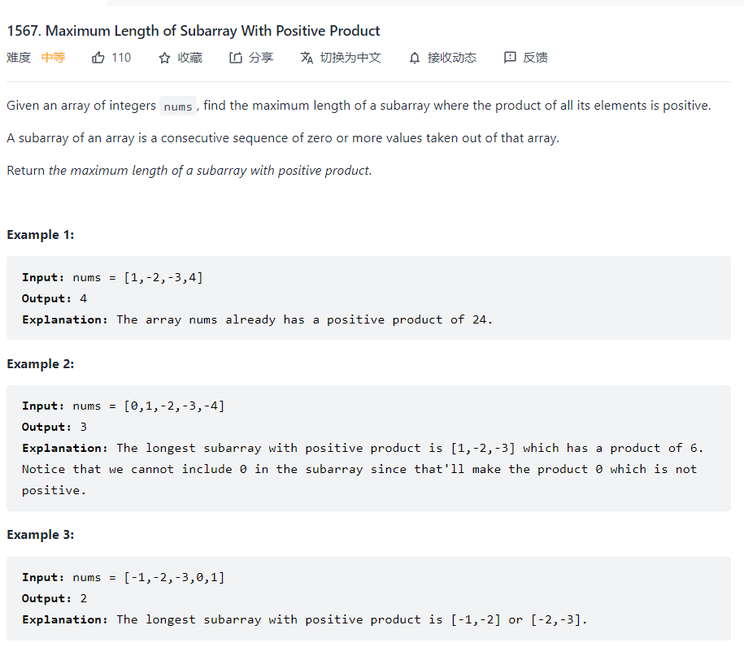

### Maximum Length of Subarray With Positive Product



Actually, there are two different ways of solving this problem. But for practicing  the dynamic-programming. I would rather use dynamic programming to solve this problem.

#### Dynamic Programming

First, seeing this problem, based on the previous solution of the maximum product, we need to store two different arrays. One is for storing the maximum length of positive number reaching this index and the other for negative number.

When encountering the number which is positive. 
$$
\begin{equation}
\text { positive }[i]=\text { positive }[i-1]+1
\end{equation}
$$

$$
\begin{equation}
\text { negative }[i]= \begin{cases}\text { negative }[i-1]+1, & \text { negative }[i-1]>0 \\ 0, & \text { negative }[i-1]=0\end{cases}
\end{equation}
$$

Thats because when the $negative[i-1]=0$,we can not add one to this which means this index of value can not be included.

So same as the negative number
$$
\begin{equation}
\text { positive }[i]= \begin{cases}\text { negative }[i-1]+1, & \text { negative }[i-1]>0 \\ 0, & \text { negative }[i-1]=0\end{cases}
\end{equation}
$$

$$
\begin{equation}
\text { negative }[i]=\text { positive }[i-1]+1
\end{equation}
$$

Then the code I write for this problem is 

```python
def getMaxLen(self, nums: List[int]) -> int:
        n = len(nums)
        dp_pos = [0]*n
        dp_neg = [0]*n
        dp_pos[0] = 1 if nums[0] > 0 else 0 
        dp_neg[0] = 1 if nums[0] < 0 else 0
        for i in range(1,n):
            if nums[i] < 0:
                if  dp_neg[i-1] > 0:
                    dp_pos[i] = dp_neg[i-1]+1
                    dp_neg[i] = dp_pos[i-1]+1
                else:
                    dp_neg[i] = dp_pos[i-1]+1
            elif nums[i] > 0:
                if dp_neg[i-1] > 0:
                    dp_pos[i] = dp_pos[i-1]+1
                    dp_neg[i] = dp_neg[i-1]+1
                else:
                    dp_pos[i] = dp_pos[i-1]+1
            elif nums[i] == 0:
                dp_neg[i] = 0
                dp_pos[i] = 0
        # print(dp_pos)
        # print(dp_neg)
        return max(dp_pos)
```

It seems a little bit dummy but I think it can be optimized in different ways like decreasing the space complexity.

[乘积为正数的最长子数组长度 - 乘积为正数的最长子数组长度 - 力扣（LeetCode） (leetcode-cn.com)](https://leetcode-cn.com/problems/maximum-length-of-subarray-with-positive-product/solution/cheng-ji-wei-zheng-shu-de-zui-chang-zi-shu-zu-ch-3/)

