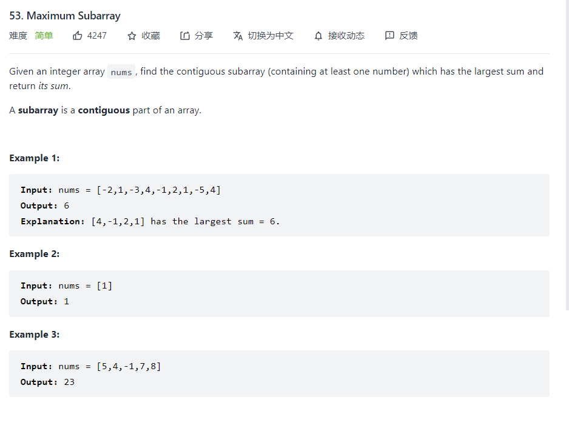

### Maximum Subarray



The above question is not hard to solve. First, based on the general dynamic programming scheme, defining a dp array which stores the maximum values of the corresponding index. And for the next state, we need to compare  the current one dp value and the next nums value of the specific index.
$$
dp[i] = max(dp[i-1]+nums[i],nums[i])
$$
 So, after working out the recursive equations, the coding is easy

```python
    def maxSubArray(self, nums: List[int]) -> int:
        n = len(nums)
        dp = [0]*(n)
        dp[0] = nums[0]
        for i in range(1,n):
            dp[i] = max(dp[i-1]+nums[i],nums[i])
        return max(dp)
```

if it is not clear enough, I think the reference will help.

[最大子序和（python3）穷举＋贪心＋动态规划 - 最大子数组和 - 力扣（LeetCode） (leetcode-cn.com)](https://leetcode-cn.com/problems/maximum-subarray/solution/zui-da-zi-xu-he-python3qiong-ju-tan-xin-u8dgc/)

