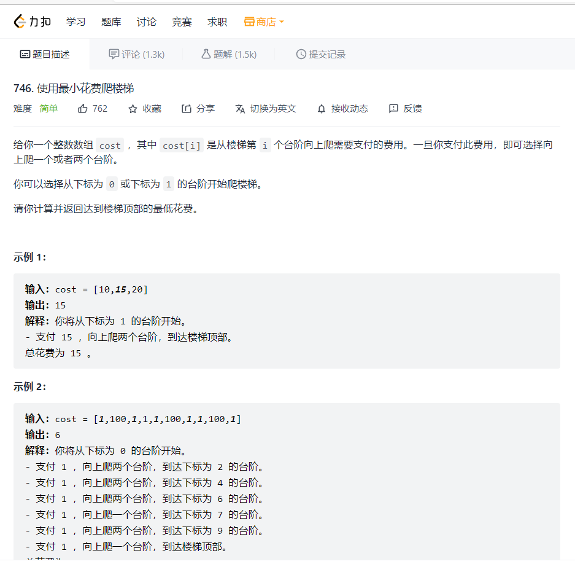

### 最下代价爬楼梯



类似背包问题，可以求出相应的递归式
$$
\begin{equation}
\min \cos t[i]=\min (\min \cos t[i-1]+\cos t[i], \min \cos t[i-2]+\cos t[i-1])
\end{equation}
$$
但我采取了思路二进行考虑问题
$$
\begin{equation}
d p[i]=\min (d p[i-2], d p[i-1])+\cos t[i]
\end{equation}
$$

```python
    def minCostClimbingStairs(self, cost: List[int]) -> int:
        steps = len(cost)
        if steps == 2:
            return min(cost[0],cost[1])
        dp = [[0]*(steps+1) for i in range(2)]
        # dp_0  =[0]*(steps+1)
        # dp_0[1] = cost[0]
        # dp_0[2] = cost[0]
        # dp_1 = [0]*(steps+1)
        # dp_1
        dp[0][1],dp[0][2] = cost[0],cost[0]
        dp[1][2],dp[1][3] = cost[1],cost[1]
        for i in range(3,steps+1):
            if i == 3:
                dp[0][i] = min(dp[0][i-1]+cost[i-1],dp[0][i-2]+cost[i-2])
            else:
                dp[0][i] = min(dp[0][i-1]+cost[i-1],dp[0][i-2]+cost[i-2])
                dp[1][i] = min(dp[1][i-1]+cost[i-1],dp[1][i-2]+cost[i-2])
        # print(dp)
        return min(dp[0][steps],dp[1][steps])
```

更加简单的动态规划编程是，主要在于减少空间复杂度

```python
def minCostClimbingStairs(self, cost: List[int]) -> int:
        if len(cost)==1:return cost[0]
        if len(cost)==2:return min(cost)
        dp=[0 for _ in range(len(cost)+1)]
        for i in range(2,len(dp)):
            dp[i]=min(dp[i-1]+cost[i-1],dp[i-2]+cost[i-2])
        return dp[-1]
```

如果想更加减少空间复杂度，需要声明两个中间变量来只需要常数级的空间复杂度

控制两个dp[i-1],dp[i-2]

