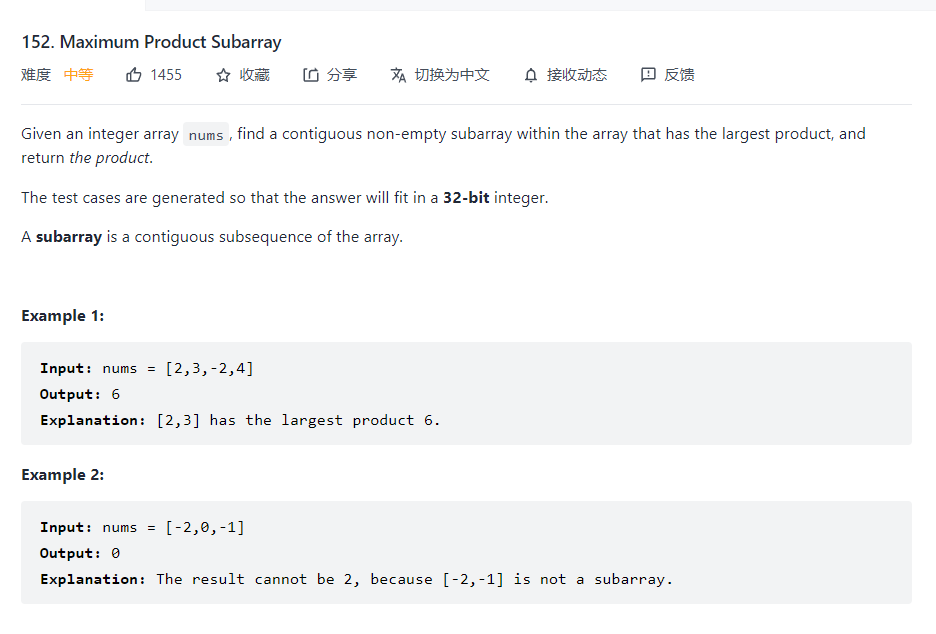

### The maximum product subarray



Given this problem, the first thing always come to my mind is dynamic programming and the way of solving that is define the transition equation where it is not quite obvious because there will be two different occasions. The first one is that we need to consider the minus number so storing the minimum number in case of encountering the number which is opposite with the current max value.

Based on the above method, implementing the equation is not that challenging.

```python
    def maxProduct(self, nums: List[int]) -> int:
        n = len(nums)
        dp_max = [0]*(n)
        dp_min = [0]*(n)
        dp_max[0] = nums[0]
        dp_min[0] = nums[0]
        for i in range(1,n):
            dp_max[i] = max(dp_max[i-1]*nums[i],dp_min[i-1]*nums[i],nums[i])
            dp_min[i] = min(dp_min[i-1]*nums[i],dp_max[i-1]*nums[i],nums[i])
        return max(dp_max)
```

In order to review cpp, I also transform the python to cpp version which is highly similar.

```c++
class Solution {
public:
    int maxProduct(vector<int>& nums) {
        int length = nums.size();
        vector<int>dp_max(length,0);
        vector<int>dp_min(length,0);
        dp_max[0] = nums[0];
        dp_min[0] = nums[0];
        for(int i = 1; i<length;i++) {
            dp_max[i] = max(dp_max[i-1]*nums[i],max(dp_min[i-1]*nums[i],nums[i]));
            dp_min[i] = min(dp_min[i-1]*nums[i],min(dp_max[i-1]*nums[i],nums[i]));
        }
        int max_value = *max_element(dp_max.begin(),dp_max.end());
        return max_value;
    }
};
```

[乘积最大子数组 - 乘积最大子数组 - 力扣（LeetCode） (leetcode-cn.com)](https://leetcode-cn.com/problems/maximum-product-subarray/solution/cheng-ji-zui-da-zi-shu-zu-by-leetcode-solution/)

