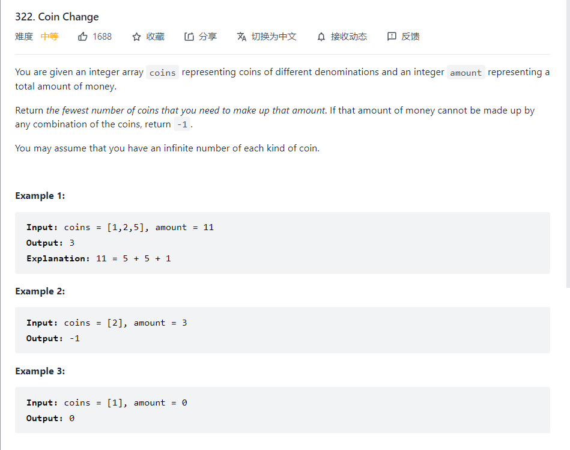
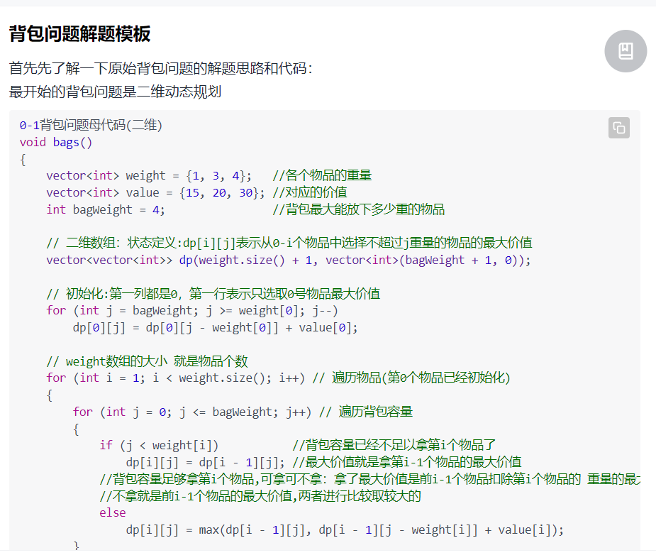
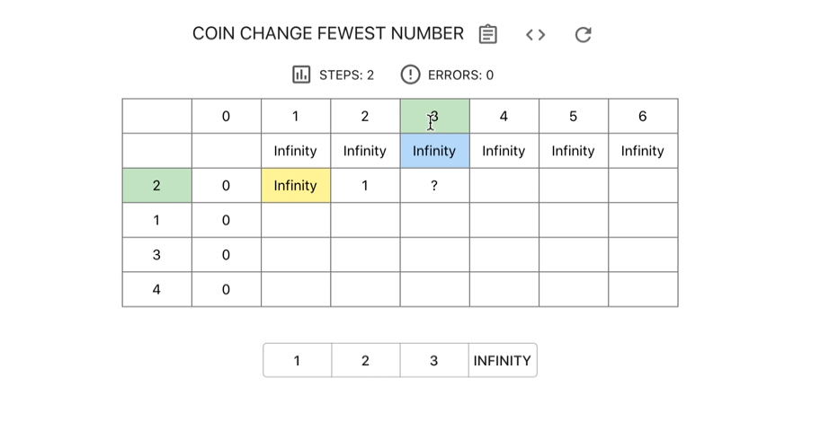

### Coin Change



传统的动态规划问题，在这里解题思路应该是构建二维dp表，这样子可以记录不同硬币的需要的数量，是传统背包问题的变种，而应对背包问题应该需要套用下面的模板



这里和背包问题的思路很像，也是拿不下就接上一个最小的数量，每一个放置的是当前面值对应的最小硬币数



构建二维dp表，然后找到对应的状态转移方程，最终写成代码

```c++
class Solution {
public:
    int coinChange(vector<int>& coins, int amount) {
        vector<vector<int>> dp(coins.size()+1,vector<int>(amount+1));
        // cout<<dp[0].size();
        for(int i=0;i<amount+1;i++) {
            dp[0][i] = amount+1;
        }
        for(int i=1;i<coins.size()+1;i++) {
            for(int j=1;j<=amount;j++) {
                if(j>=coins[i-1]) {
                    dp[i][j] = min(dp[i-1][j],dp[i][j-coins[i-1]]+1);
                }
                else {
                    dp[i][j] = dp[i-1][j];
                }
            }
        }
        if(dp[coins.size()][amount]==amount+1) {
            return -1;
        }
        else {
            return dp[coins.size()][amount];
        }        
    }
};
```

其实，可以发现，利用前向的relaxation也可以解答问题，同时进行空间的优化

```python
class Solution:
    def coinChange(self, coins: List[int], amount: int) -> int:
        if amount == 0:
            return 0
        dp = [amount+1]*(amount+1)
        min_coin = min(coins)
        for coin in coins:
            if coin <= amount:
                dp[coin] = 1
        for i in range(min_coin,amount+1):
            for coin in coins:
                if i + coin < amount+1 and dp[i] != amount+1:
                    dp[i+coin] = min(dp[i]+1,dp[i+coin])
        if dp[amount] != amount+1:
            return dp[amount]
        else:
            return -1
```

这样子空间复杂度可以降到$O(amount)$

