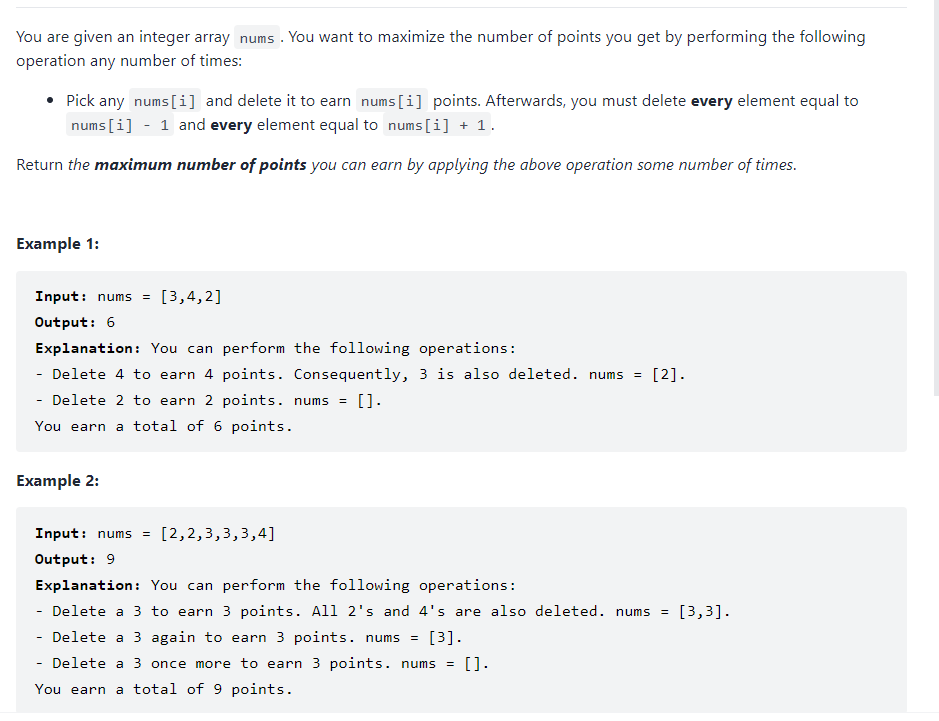
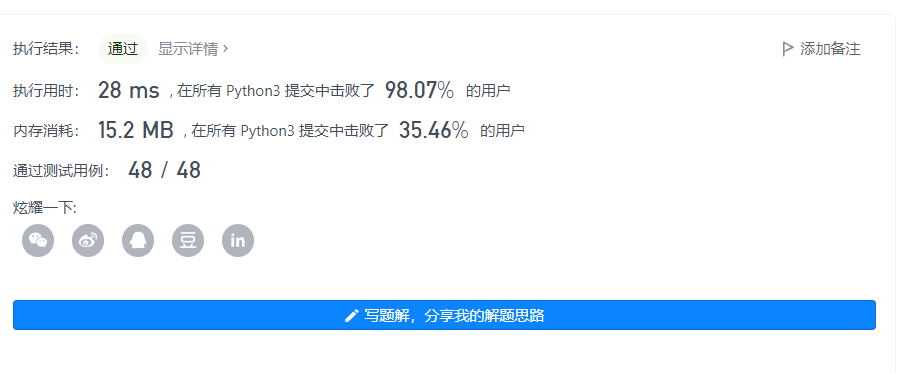

### 删除并获取



和House robber 问题类似，就是在选取了一个num[i]之后，连着num[i]+1 或者num[i]-1都不能选择

所以这个时候我们为了简化问题，需要先对数组进行一下处理，首先需要利用一个count的字典来存储每一个重复出现的数字，然后对数组进行排序，这样子就可以转化成相邻位置选择或者不选择的，因为保证相邻位置差距最小是1，所以可以转化成house robber问题

```python
def deleteAndEarn(self, nums: List[int]) -> int:
    # nums = sorted(nums)#默认升序
    count = {}
    for num in nums:
        count[num] = count.get(num,0)+1 
    nums = sorted(list(count.keys()))
    n = len(nums)
    # print(nums)  
    dp = [0]*(n+1)
    dp[1] = nums[0]*count[nums[0]]
    for i in range(2,n+1):
       if nums[i-1] == nums[i-2]+1:
          dp[i] = max(dp[i-1],dp[i-2]+nums[i-1]*count[nums[i-1]])
       else:
          dp[i] = dp[i-1]+nums[i-1]*count[nums[i-1]] 
    return dp[n]
```



当然可以利用之前对空间复杂度的优化方法进行优化

当然得考虑两种不同的状态
$$
dp[i] = max(dp[i-1],dp[i-2]+count[nums[i]]*nums[i]) \\ 
\text{Where nums[i]=nums[i-1]+1} \\
dp[i] = dp[i-1]+nums[i]*count[nums[i]] \\
\text{where nums[i] != nums[i-1]+1}
$$
House robber是dp里面比较经典的问题，需要比较充分的理解，本质上都是分解成子问题

[这小偷又来偷了！他怎么这么聪明！ - 删除并获得点数 - 力扣（LeetCode） (leetcode-cn.com)](https://leetcode-cn.com/problems/delete-and-earn/solution/zhe-xiao-tou-you-lai-qiang-jie-liao-ta-z-w29x/)

参考解释

