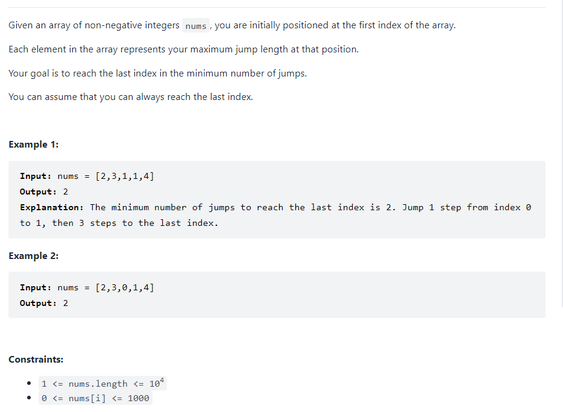

### Jump Game II



Here is the description of the problem which is in high similarity of the jump game. Whats the huge difference is that the premise here is that the guarantee of the reach of the last index

Similarly, there are two different approaches for solving it. One is dynamic programming which will exceed the excepted time. The other is greedy algorithm.

### Dynamic Programming

When coming across this problem, with the inspiration of dynamic programming, the first thing comes to my mind is using dp arrays to store the minimum steps reached for each index. Based on this approach, implementing is not quite difficult where the recursive equation is 
$$
dp[i] = min(dp[j]+1\quad j=0\ldots i-1|nums[j]+j \geqslant i) 
$$

```python
    def jump(self, nums: List[int]) -> int:
        n = len(nums)
        dp = [n]*(n)
        dp[0] = 0
        min_step = n
        for i in range(1,n):
            min_step = n
            for j in range(i):
                if j+nums[j] >= i:
                    min_step = min(min_step,dp[j]+1)
            dp[i] = min_step
        return dp[-1]
```

Although the above one works, it can not reach the expectation of complexity because the above one is $O(n^2)$

#### Relaxation

Here, in order to reduce the duplicate comparisons in method one, the second thing is that we do not need to do the compare. Instead, iterating it directly and the method is as follows:

```python
    def jump(self, nums: List[int]) -> int:
        n = len(nums)
        dp = [n]*(n)
        dp[0] = 0
        min_step = n
        for i in range(1,n):
            min_step = n
            for j in range(i):
                if j+nums[j] >= i:
                    min_step = min(min_step,dp[j]+1)
            dp[i] = min_step
        return dp[-1]
```

However, the time complexity is still $O(n^2)$,which is not satisfied enough. 

#### Greedy

With the greedy motivation, if we always jump to the most furthest index, we can guarantee that the time complexity is down to $O(n)$

When iterating the array, once reaching the boundary area, add one on the variable steps, which means we choose this index for this jump trial because it can reach the most furthest. 

```python
    def jump(self, nums: List[int]) -> int:
        n = len(nums)
        max_pos, steps,end = 0,0,0
        for i in range(n-1):
            max_pos = max(nums[i]+i,max_pos)
            if i == end:
                end = max_pos
                steps += 1
        return steps
```

   [跳跃游戏 II - 跳跃游戏 II - 力扣（LeetCode） (leetcode-cn.com)](https://leetcode-cn.com/problems/jump-game-ii/solution/tiao-yue-you-xi-ii-by-leetcode-solution/)

