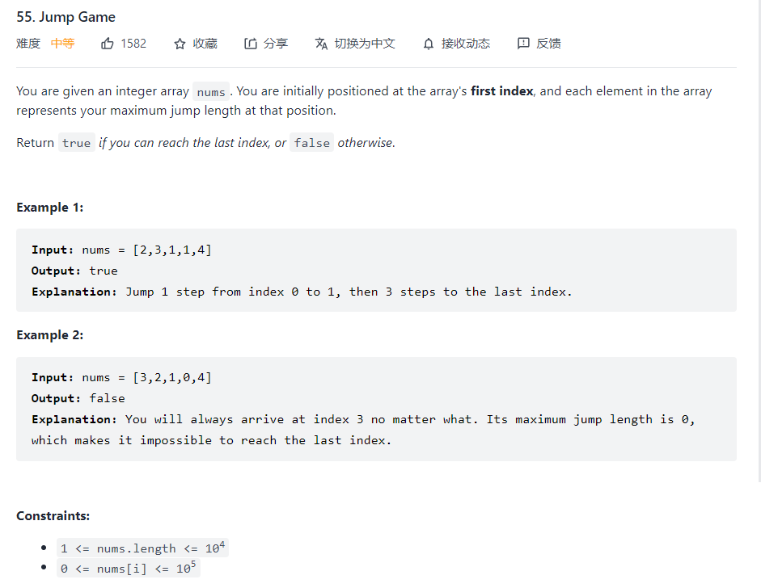

### Jump Game



Jump Game的介绍，就是判断是否能够到达最终的目的地，每一个表示nums[i]可以跳跃的步数

#### 方法1：

##### 动态规划

```python
    def canJump(self, nums: List[int]) -> bool:
        n = len(nums)
        dp = [0]*(n)
        dp[0] = nums[0]
        for i in range(n):
            dp[i-1]
        for i in range(1,n):
            for j in range(i):
                if dp[j] == 1:
                    if nums[j] >= i-j:
                        dp[i] = 1
                        break
        if dp[-1] == 1:
            return True
        else:
            return False
```

在每个dp中装有是否能到达的信息，能则是设置为1，不能设置为0，这意思是在dp中我们每一个值都得进行遍历所以会使得整个时间复杂度会到达$O(n^2)$,因为
