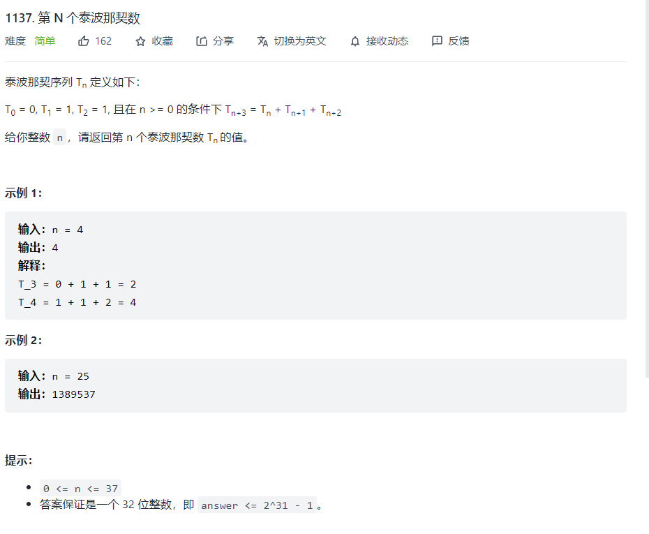

### 三元斐波那契数列



题目描述：其实就是一个三元得斐波那契，可以根据斐波那契数列的动态规划的解法进行

```python
def tribonacci(self, n: int) -> int:
        if n < 2:
            if n == 0:
                return 0
            elif n==1:
                return 1
        dp = [0]*(n+1)
        dp[1] = 1
        dp[2] = 1
        for i in range(3,n+1):
            dp[i] = dp[i-1]+dp[i-2]+dp[i-3]
        return dp[n]
```

就是根据递推式来进行

初级动态规划

